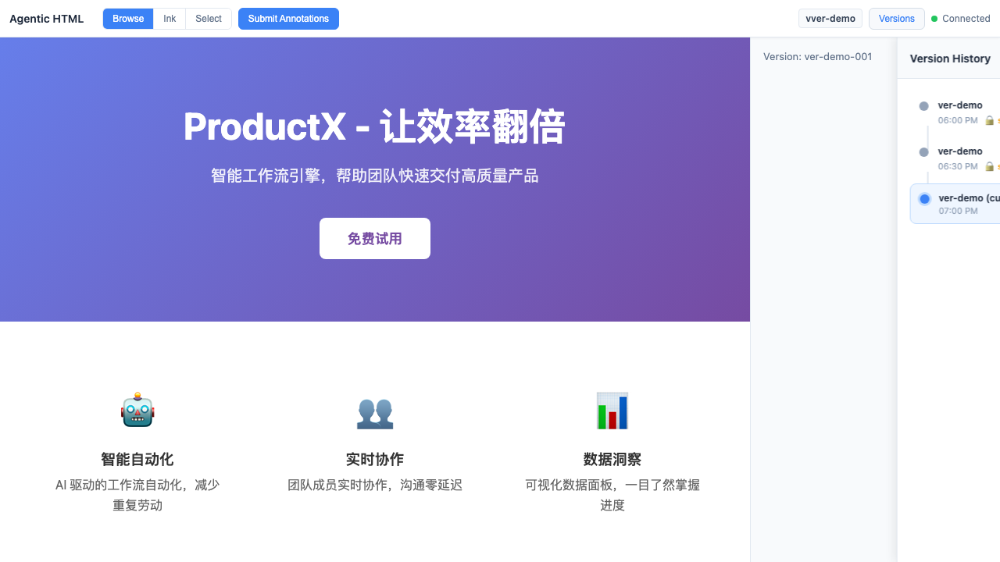
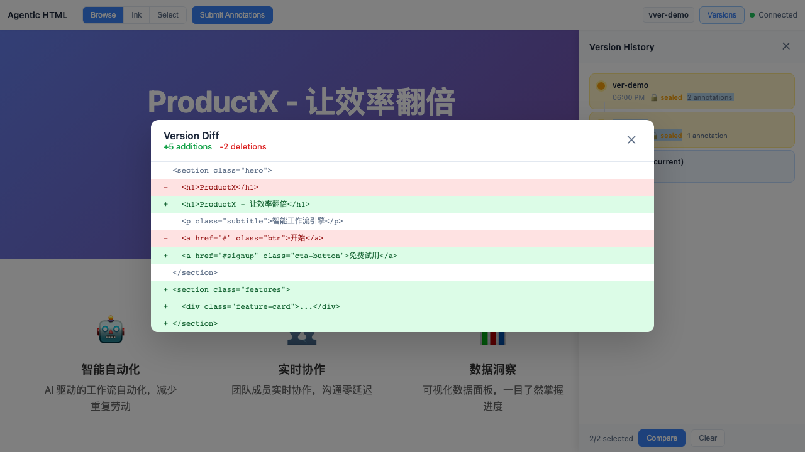
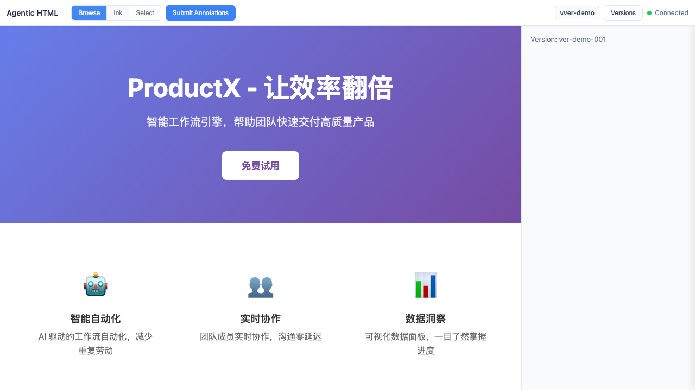
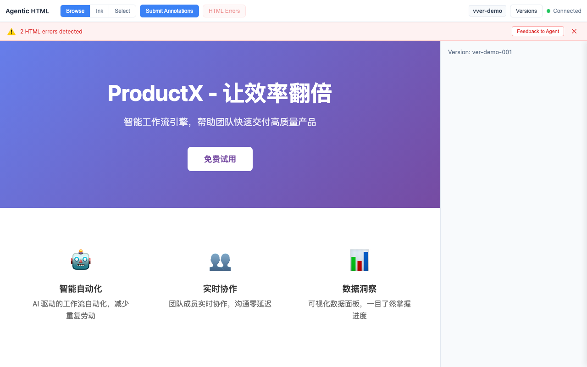

# Agent Native HTML 编辑插件：从零到一的技术复盘

> 本文面向有 TypeScript/Node.js 经验的开发者，系统总结 agentic-html 项目的设计决策、架构实现和踩坑经验。

## 1. 需求背景

### 痛点

AI 编码代理（Claude Code、Codex CLI、Cursor 等）在生成 HTML 后面临一个根本性问题：**Agent 无法"看到"渲染结果**。

当前的反馈闭环完全依赖文字描述：

```
用户: "把标题改大一点，颜色换成蓝色"
Agent: （修改代码）
用户: "不对，我说的是右边那个标题，不是主标题"
Agent: "抱歉，请问您指的是哪个元素？"
```

这个流程的核心缺陷：
- **定位模糊**：用户无法精确告诉 Agent "我说的是页面上哪个元素"
- **反馈低效**：视觉问题需要用文字翻译成代码语言，信息严重损耗
- **迭代缓慢**：每轮反馈都需要手动描述 → Agent 猜测 → 验证，循环多次

### 目标

让用户能够**直接在 HTML 预览页面上圈画标注**，将视觉反馈精确传递给 Agent：

```
用户: 在预览页面上用笔迹圈住那个标题 → 输入"改成品牌蓝色 #1a73e8"
Agent: 收到标注（含截图 + 精确 DOM 定位），直接修改目标元素
```

一次交互即可完成，无需多轮文字沟通。

## 2. 技术方案要点

### 三层架构

```
┌─────────────────────────────────────────────────────────┐
│  UI 层（React 前端）                                      │
│  - 预览渲染 (iframe + srcdoc)                            │
│  - 标注交互 (Canvas/SVG overlay)                         │
│  - 版本 Graph 可视化                                     │
├─────────────────────────────────────────────────────────┤
│  Gateway 层（同构双网关）                                 │
│  ┌──────────────────┬──────────────────┐                │
│  │  MCP Gateway      │  CLI Gateway     │                │
│  │  stdio 传输       │  命令行接口       │                │
│  │  Agent 实时调用   │  脚本/手动调用    │                │
│  └────────┬─────────┴────────┬─────────┘                │
│           └────────┬─────────┘                           │
│                    ▼                                      │
├─────────────────────────────────────────────────────────┤
│  Core Service 层（纯业务逻辑，无 I/O 依赖）               │
│  - PreviewService: 预览启动 / 热更新                      │
│  - VersionService: 版本创建 / 检出 / 对比 / Graph         │
│  - AnnotationService: 标注 CRUD / 导出 / 提交             │
│  - SnapshotService: DOM 快照 / hit-test                   │
│  - PatchService: CSS Selector 定位 / diff 应用            │
└─────────────────────────────────────────────────────────┘
```


### 5 个核心 Service

| Service | 职责 | 关键方法 |
|---------|------|----------|
| `PreviewService` | HTML 文件渲染、Express HTTP 服务、WebSocket 热更新 | `start()`, `stop()`, `refresh()` |
| `VersionService` | 不可变版本快照、树形版本号、sealed 机制 | `create()`, `checkout()`, `compare()`, `history()` |
| `AnnotationService` | 标注 CRUD、格式化导出、提交触发 seal | `create()`, `submit()`, `export()` |
| `SnapshotService` | DOM 树序列化、区域 hit-test | `get()`, `hitTest()` |
| `PatchService` | CSS Selector 定位、cheerio DOM 操作、diff 生成 | `apply()`, `preview()` |

### 版本管理设计

核心理念：**每个版本是不可变的 HTML 快照**。

```
v1 (sealed) ─┬─── v1.1 (sealed) ─── v1.1.1 (working)
              │
              └─── v1.2 (sealed)
```

- 新版本创建时为 `unsealed`（可编辑标注）
- 用户点击"发送给 Agent"时自动 `seal`（标注随之固化）
- `sealed` 后版本和标注均为只读，永久保留
- 树形版本号：父 v1 的子版本为 v1.1、v1.2...





### 标注系统

所有标注统一为 **"锚点元素 + 评论"** 结构：

```typescript
interface Annotation {
  id: string;
  anchor_element: DOMPosition;    // CSS Selector 定位
  comment: string;                // 用户修改意见
  screenshot?: string;            // 圈画区域截图（base64）
  hit_elements?: HitElement[];    // 命中的 DOM 元素列表
  status: 'pending' | 'resolved';
  version_id: string;
}
```

笔迹圈画和直接点选只是**选中方式不同**，最终产物一致。笔迹本身只在绘制过程中临时渲染，完成后立即清除，只保留截图和 hit-test 结果。




### 同构网关

MCP 和 CLI 功能完全对等，共享 Core Service：

```typescript
// MCP Gateway - tool handler
async function handlePreviewHtml(args: { file_path: string; port?: number }) {
  const session = await previewService.start(args.file_path, { port: args.port });
  return success({ url: session.url, session_id: session.sessionId, version_id: session.versionId });
}

// CLI Gateway - command handler
program.command('preview <file>')
  .option('--port <number>')
  .action(async (file, opts) => {
    const session = await previewService.start(file, { port: opts.port });
    output(session);
  });
```

两个 Gateway 的差异仅在：参数解析格式、输出序列化方式、推送机制（MCP notification vs 文件系统写入）。

## 3. 关键设计决策

### 决策 1：自建 MCP Server vs 复用现有工具

**背景**：市面上有一些通用的 HTML 预览工具（如 live-server），是否可以复用？

**取舍**：
- 复用方案：无法深度集成标注系统、版本管理、Agent 双向通信
- 自建方案：开发量大，但能实现完整闭环

**结论**：自建 MCP Server。核心理由是标注 → Agent 反馈 → 定向修改这条链路需要深度定制，通用工具无法满足"在预览页面上标注后直接推送给 Agent"的需求。

### 决策 2：不存储笔迹 path → 只保留截图 + 锚点

**背景**：用户在页面上画的笔迹（SVG path data）要不要持久化存储？

**取舍**：
- 存储 path：浏览器窗口大小变化后坐标失真，path 毫无意义
- 不存储 path：丢失了精确的绘制轨迹，但截图能完整保留视觉信息

**结论**：笔迹仅作为临时圈选工具，完成后立即清除画布。保留的信息：
1. 截图（圈画区域的视觉快照）
2. 锚点元素（hit-test 确定的主要 DOM 节点）
3. hit_elements 列表（圈画区域内命中的所有元素）

这三者足以让 Agent 精确理解用户意图。

### 决策 3：sealed/unsealed 机制 vs 标注状态字段

**背景**：如何控制标注的可编辑性？

**备选方案**：
- A. 给每个标注加 `editable` 字段，逐个控制
- B. 版本级 sealed 机制，整体冻结

**结论**：选择 B。理由：
1. 标注是版本的不可分割部分，应该跟随版本整体 seal
2. 简化了并发控制——sealed 版本不需要考虑修改冲突
3. 语义清晰——"提交给 Agent"这个动作天然是一个 seal 时点

### 决策 4：hit-test 网格采样 + body 兜底 vs Web Worker

**背景**：笔迹圈画后需要确定命中了哪些 DOM 元素。

**备选方案**：
- A. 网格采样 `elementsFromPoint`（主线程）
- B. 将 DOM 结构发送到 Web Worker 做空间索引查询

**结论**：选择 A。理由：
1. V1 阶段页面复杂度有限，网格步长 10px 的采样在 2s 内可完成
2. Web Worker 需要序列化 DOM 位置信息，额外复杂度高
3. 加入 body 兜底机制——**hit-test 永远不会返回空**，最差也能命中 body

### 决策 5：文件系统 JSON 存储 vs SQLite

**背景**：版本、标注数据如何持久化？

**取舍**：
- SQLite：查询能力强，但增加二进制依赖，跨平台安装可能出问题
- JSON 文件：无额外依赖，可直接 git 追踪，人类可读

**结论**：JSON 文件存储。项目定位是 CLI 工具/插件，数据量有限（单会话 200 版本上限），JSON 足够。额外好处是用户可以直接用编辑器查看 `.html-editor/` 目录下的数据。

### 决策 6：cheerio vs jsdom

**背景**：PatchService 需要解析和操作 HTML DOM。

**取舍**：
- jsdom：完整 DOM API，但初始化慢（~200ms），内存消耗大
- cheerio：轻量快速（~5ms 解析），jQuery 风格 API，但不支持 JS 执行

**结论**：选择 cheerio。理由：
1. PatchService 只需要 CSS Selector 查找 + DOM 增删改，不需要执行 JS
2. 性能优势明显——`apply_patch` 的响应时间要求 < 200ms
3. cheerio 的 API（`$(selector).replaceWith(content)`）天然适配 patch 操作

```typescript
// PatchService 核心实现
import * as cheerio from 'cheerio';

const $ = cheerio.load(htmlContent);
const target = $(patch.selector);
if (target.length === 0) {
  failures.push({ patch, reason: 'Element not found' });
  continue;
}
switch (patch.action) {
  case 'replace': target.replaceWith(patch.content!); break;
  case 'delete': target.remove(); break;
  case 'insert_before': target.before(patch.content!); break;
  case 'insert_after': target.after(patch.content!); break;
  case 'modify_style': /* ... */ break;
}
```

### 决策 7：CSS Selector 静态不失效设计

**背景**：标注需要定位 DOM 元素，如果页面结构变了怎么办？

**关键洞察**：每个版本的 HTML 是**静态不可变快照**（sealed 后不变），标注是针对特定版本的。因此：

> 在同一个版本内，DOM 结构永远不会变化，CSS Selector 永远有效。

这个设计巧妙地消除了传统标注系统中"元素定位失效"的难题。无需 XPath fallback、无需文本内容匹配、无需模糊定位——直接用 CSS Selector 精确定位即可。

## 4. 踩坑记录

### 4.1 ES Module + CommonJS 混合问题

`diff-match-patch` 是一个纯 CommonJS 包，在 ESM 项目中直接 import 会失败。

**解决方案**：手写 `.d.ts` 类型声明文件：

```typescript
// src/core/diff-match-patch.d.ts
declare module 'diff-match-patch' {
  type Diff = [number, string];
  class diff_match_patch {
    diff_main(text1: string, text2: string): Diff[];
    diff_cleanupSemantic(diffs: Diff[]): void;
    // ...
  }
  export default diff_match_patch;
}
```

项目配置 `"type": "module"`，但 diff-match-patch 导出的是 default export 的类。需要 `import DiffMatchPatch from 'diff-match-patch'` 然后 `new DiffMatchPatch()` 使用。

### 4.2 uuid mock 在多 Service 共享时 ID 冲突

多个 Service（VersionService、AnnotationService）都使用 `uuid.v4()` 生成 ID。在单元测试中 mock uuid 时，如果返回固定值，会导致不同 Service 创建的实体 ID 相同而冲突。

**解决方案**：使用递增 counter 的 mock 策略：

```typescript
let counter = 0;
vi.mock('uuid', () => ({
  v4: () => `mock-id-${++counter}`
}));
```

### 4.3 集成测试中 Service 实例共享问题

VersionService 使用了 `static sharedVersions: Map` 来实现跨 Service 实例的版本共享。如果测试之间不清理，状态会泄漏。

**解决方案**：提供 `VersionService.reset()` 静态方法，在每个测试的 `beforeEach` 中调用：

```typescript
beforeEach(() => {
  VersionService.reset();
});
```

### 4.4 MCP 工具返回格式

MCP 协议要求工具返回 `{ content: [{ type: 'text', text: '...' }] }` 格式。早期实现直接返回 JSON 对象，导致 Agent 端解析失败。

**解决方案**：统一包装函数：

```typescript
function success(data: unknown): ToolResult {
  return {
    content: [{ type: 'text', text: JSON.stringify(data) }],
  };
}
```

错误响应也需要结构化返回（包含 error code），方便 Agent 程序化处理：

```typescript
function wrapError(err: unknown): ToolResult {
  if (err instanceof HtmlEditorError) {
    return { content: [{ type: 'text', text: JSON.stringify({ code: err.code, message: err.message }) }], isError: true };
  }
  return { content: [{ type: 'text', text: String(err) }], isError: true };
}
```

### 4.5 TypeScript 类型包缺失

运行时依赖（express、ws、uuid）的类型定义需要作为 devDependencies 安装：

```json
{
  "devDependencies": {
    "@types/express": "^5.0.6",
    "@types/uuid": "^10.0.0",
    "@types/ws": "^8.18.1"
  }
}
```

遗漏任一包都会导致 `pnpm typecheck` 失败，且错误信息可能指向看似无关的位置（如某个 import 的类型推断失败）。



## 5. 可复用经验

### 5.1 TDD 驱动开发

先写 286 个测试用例（单元 + 集成），再实现代码。

**收益**：
- 接口契约先于实现确定，避免"实现反推接口"导致的设计扭曲
- 每个 Service 的边界条件在测试中就已明确（错误码、边界值、异常分支）
- 重构时有信心——改内部实现不影响测试通过

**实践建议**：
- 每个 Service 对应一个测试文件，按方法分组 `describe`
- 集成测试验证跨 Service 协作（如 PatchService 调用 VersionService 创建新版本）
- 测试文件组织：`tests/unit/core/` + `tests/integration/`

### 5.2 分层解耦：Core Service 不依赖传输层

Core Service 层是纯业务逻辑，不包含任何 HTTP/WebSocket/CLI 相关代码。

```
✅ Core Service 可以依赖：types, errors, config, fs, uuid, cheerio, diff-match-patch
❌ Core Service 不可依赖：express, ws, commander, @modelcontextprotocol/sdk
```

**收益**：
- 单元测试无需启动 HTTP Server
- 新增 Gateway（如 HTTP REST API）只需实现参数转换层
- Core Service 可以被嵌入到其他运行时（如浏览器端的 WASM 版本）

### 5.3 同构网关模式

Gateway 层的代码严格限制为三件事：参数解析 → 调用 Core Service → 格式化输出。

```
MCP Gateway:  JSON-RPC 参数 → camelCase 转换 → coreService.method() → McpContent 格式化
CLI Gateway:  命令行参数   → camelCase 转换 → coreService.method() → stdout JSON/text
```

**命名约定**：
- MCP 参数：`snake_case`（`version_id`）
- CLI 参数：`kebab-case`（`--version-id`）
- Core Service：`camelCase`（`versionId`）

新增一个 Core Service 方法时，必须同时在两个 Gateway 注册对应入口——这个约束通过集成测试保证。

### 5.4 原子文件写入

版本快照写入磁盘时使用 temp + rename 模式，保证数据一致性：

```typescript
async function atomicWrite(filePath: string, content: string): Promise<void> {
  const tmpPath = filePath + '.tmp.' + Date.now();
  await fs.writeFile(tmpPath, content, 'utf-8');
  await fs.rename(tmpPath, filePath);  // 原子操作
}
```

即使进程在写入过程中崩溃，也不会产生半写的损坏文件。

### 5.5 版本快照不可变设计

`sealed` 版本的 HTML 和标注都不可变，这带来一系列简化：
- **无并发冲突**：sealed 数据只读，多个 Agent/用户同时读取无问题
- **CSS Selector 永远有效**：DOM 不变，selector 不会失效
- **缓存友好**：sealed 版本的快照可以无限期缓存
- **审计追溯**：完整的修改历史不可篡改

## 6. 项目数据

| 指标 | 数值 |
|------|------|
| 源文件总数 | ~45 个（Core 10 + Gateway 5 + UI 30） |
| 测试用例数 | 286 个（11 个测试文件，单元 + 集成） |
| 测试状态 | 全部 GREEN |
| 核心依赖 | 8 个：cheerio、express、ws、diff-match-patch、commander、chokidar、uuid、@modelcontextprotocol/sdk |
| 类型定义 | 40+ 接口/类型 |
| 错误码 | 17 个，覆盖 5 个模块 |
| MCP 工具数 | 9 个（preview_html 到 close_preview） |
| CLI 命令数 | 9 个（与 MCP 完全对等） |

---

*本文档基于 agentic-html v0.1.0 编写，对应 RFC `rfcs/html-editor-plugin.md` 和 SPEC `specs/html-editor-plugin.md`。*
